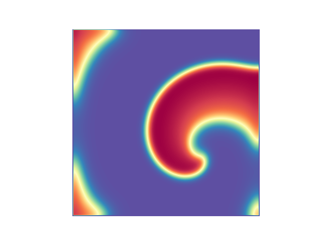

# Summary
The growing progress in cardiac and medical modeling opens broad opportunities for the development of tools and software packages that enable simulations
for both research and clinical purposes. Mathematical modeling and numerical simulation have become essential for understanding cardiac arrhythmias, testing hypotheses in silico, and supporting the development of medical devices and therapies [@Jaffery_2024; @Trayanova_2024].

We present **Finitewave**, a lightweight and extensible Python framework designed for fast, reproducible, and accessible simulations of cardiac electrical propagation using finite difference methods. Finitewave significantly lowers the entry barrier for students, researchers, and users without 
a strong technical background. Its modular structure, fast numerical core, and seamless integration with Python's scientific ecosystem allow for both rapid prototyping and advanced analysis using standard tools for visualization and post-processing.


# Statement of need
Over the past decades, numerous tools have been developed to simulate normal and pathological cardiac activity, including electrical propagation, contraction, and anatomical features. As cardiac models have become more detailed and biophysically accurate, their computational cost and complexity have increased. Platforms like **OpenCARP**, **Chaste** or **Lifex-ep** [@Plank_openCARP; @Cooper_Chaste; @africa2022lifexcore] offer powerful capabilities but are often difficult to set up, tightly coupled to HPC environments, and challenging to use and modify - especially for users without a strong computational background. Other tools like **Myokit** [@Clerx2016Myokit] focus on single-cell simulations but may lack multi-dimensional support.

**Finitewave** addresses this gap by offering a lightweight, transparent, and Python-native framework for cardiac modeling. It is designed to enable early user engagement in the modeling process, with a clear and modular structure that supports experimentation, learning, and customization. 
Its Python foundation allows smooth integration with other libraries (e.g., NumPy, Matplotlib, SciPy, Jupyter) and makes it ideal for use in educational and research settings.

Finitewave is particularly suited for:

- **Research**: Studying wave propagation, reentry, or arrhythmias under various physiological conditions (e.g., fibrosis).

- **Hypothesis testing**: Rapid prototyping of ideas and simulation protocols.

- **Education**: Teaching modeling concepts through its modular and readable design.

- **Custom development**: Creating tailored solutions via native Python integration.

- **Dataset generation**: Producing synthetic data for machine learning or statistical analysis.

This positions Finitewave as a complementary and accessible alternative to existing platforms, offering a more flexible and user-friendly environment for cardiac modeling and experimentation.

# Usage philosophy

Finitewave supports both 2D and 3D simulations, offering an open and interactive space for implementing a wide range of computational experiments. 
A minimal working script requires only a few lines of clearly structured code, making it easy to get started. For exploratory use, simulations can also be run inside Jupyter notebooks, enabling immediate visualization and interactive analysis.

Advanced users can easily extend base scripts with custom metrics, animations, or protocol logic. This makes it possible to scale from simple demonstrations to complex simulations while retaining full transparency and control over each step.

The repository includes detailed examples, covering the main features of the framework, as well as tutorials demonstrating how Finitewave can be used  for different types of research tasks. Our goal is to make Finitewave not only convenient for experienced users but also an accessible and modern entry point into cardiac modeling for students and early-career researchers.

Despite being a relatively new open-source project, Finitewave has already been used as the primary simulation tool in at least two peer-reviewed publications [@Nezlobinsky_multiparam; @Okenov_comp_based].

# Usage example

To demonstrate the usage of Finitewave, we consider the initiation of a spiral wave - a well-known model representation of cardiac arrhythmia in cardiac tissue. For the electrophysiological model, we use the built-in Aliev-Panfilov model [@AP_1996], which captures the basic properties of cardiac tissue as an excitable medium.

Importing the finitewave package gives access to the framework’s API:

```
import finitewave as fw

import numpy as np
import matplotlib.pyplot as plt
```

We first initialize the simulation domain by creating a 2D tissue grid of size 200×200:

```
n = 200
tissue = fw.CardiacTissue2D([n, n])
```

Next, we create an instance of the Aliev-Panfilov model and define the key simulation parameters: time step (dt), spatial step (dr), and total simulation time (t_max). Recommended parameters are provided in the example scripts for each built-in model.

```
aliev_panfilov = fw.AlievPanfilov2D()
aliev_panfilov.dt = 0.01
aliev_panfilov.dr = 0.25
aliev_panfilov.t_max = 120
```

We initiate a spiral wave using the classic S1-S2 protocol: two consecutive stimuli applied at orthogonal orientations. For simplicity, we use rectangular stimuli defined by spatial coordinates, time of application, and stimulus amplitude:

```
stim_sequence = fw.StimSequence()
stim_sequence.add_stim(fw.StimVoltageCoord2D(time=0,
                                             volt_value=1,
                                             x1=1, x2=n-1, y1=1, y2=n//2))
stim_sequence.add_stim(fw.StimVoltageCoord2D(time=31,
                       volt_value=1,
                       x1=1, x2=n//2, y1=1, y2=n-1))
```

We then assign the tissue and stimulation protocol to the model and run the simulation:

```
aliev_panfilov.cardiac_tissue = tissue
aliev_panfilov.stim_sequence = stim_sequence

aliev_panfilov.run()
```

Once the simulation is complete, we visualize the final voltage distribution using matplotlib (\autoref{fig:spiral_wave}):

```
plt.imshow(aliev_panfilov.u, cmap='Spectral_r')
plt.axis('off')
plt.show()
```

This example illustrates the minimalist and accessible design of Finitewave, which enables users to run complete simulations with just a few lines of Python code - making it especially suitable for education, prototyping, and research workflows.

Full code:

```
import finitewave as fw

import numpy as np
import matplotlib.pyplot as plt


n = 200
tissue = fw.CardiacTissue2D([n, n])

aliev_panfilov = fw.AlievPanfilov2D()
aliev_panfilov.dt = 0.01
aliev_panfilov.dr = 0.25
aliev_panfilov.t_max = 120

stim_sequence = fw.StimSequence()
stim_sequence.add_stim(fw.StimVoltageCoord2D(time=0,
                                             volt_value=1,
                                             x1=1, x2=n-1, y1=1, y2=n//2))
stim_sequence.add_stim(fw.StimVoltageCoord2D(time=31,
                       volt_value=1,
                       x1=1, x2=n//2, y1=1, y2=n-1))

aliev_panfilov.cardiac_tissue = tissue
aliev_panfilov.stim_sequence = stim_sequence

aliev_panfilov.run()

plt.imshow(aliev_panfilov.u, cmap='Spectral_r')
plt.axis('off')
plt.show()
```



# References
